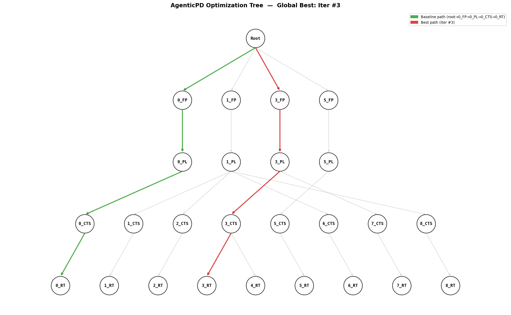

# AgenticPD — LLM Multi-Agent Physical Design QoR Optimization Framework

A prototype implementation reproducing the paper *"AgenticPD: Stage-Aware Agentic
Framework for Physical Design QoR Optimization"*: 1 Judge Agent + 4 Stage Agents
(FP/PL/CTS/RT), iteratively tuning OpenROAD Flow Scripts (ORFS) flow parameters to
optimize four QoR metrics: WNS / TNS / Area / Power. Supports any ORFS-compatible
PDK/design combination such as nangate45, sky130hd, etc.

Core mechanisms: **Optimization Tree + Branch Reuse** (zero-cost Bef-stage
inheritance) → **Observation Tool** (exploration balance E(n) + stage bottleneck
B(s)) → **Per-Stage Pipeline** (StageAgent calls LLM to generate params → make
single stage → obtain real intermediate QoR → pass to next StageAgent) →
**Automatic Tree Visualization** → **One-Click Cleanup**.

## Results


## Formalized Core Mechanisms of AgenticPD

### 1. Formalization of the Physical Design Flow

#### 1.1 Stages and Action Space
Let the physical design flow be an ordered sequence of stages:

$$
\mathcal{S} = (\text{FP},\ \text{PL},\ \text{CTS},\ \text{RT})
$$

Each stage $s \in \mathcal{S}$ has its own parameter space (action space) $\Theta_s$.
The action space of the complete flow is the Cartesian product:

$$
\Theta_{\mathrm{PD}} = \Theta_{\text{FP}} \times \Theta_{\text{PL}} \times \Theta_{\text{CTS}} \times \Theta_{\text{RT}}
$$

A complete flow run is uniquely determined by an action tuple:

$$
\mathbf{a} = (a_{\text{FP}},\ a_{\text{PL}},\ a_{\text{CTS}},\ a_{\text{RT}}) \in \Theta_{\mathrm{PD}}
$$

where $a_s \in \Theta_s$ denotes the specific parameter values chosen at stage $s$.

#### 1.2 Branching and Predecessor/Successor Relations
Since the stage order is fixed, any chosen stage $b \in \mathcal{S}$ partitions the flow into:

- **Predecessor stages**: $\mathrm{Bef}(b) = \{s \in \mathcal{S} \mid s \text{ precedes } b\}$
- **Successor stages**: $\mathrm{Aft}(b) = \{s \in \mathcal{S} \mid s \text{ follows } b\}$

**Example**: If $b = \text{CTS}$, then $\mathrm{Bef(CTS)} = \{\text{FP},\text{PL}\}$, $\mathrm{Aft(CTS)} = \{\text{RT}\}$.

#### 1.3 QoR Metrics
After executing the complete flow $\mathbf{a}$, we obtain the post-route signoff
metric tuple:

$$
Q(\mathbf{a}) = ( \text{WNS},\ \text{TNS},\ \text{Area},\ \text{Power} )
$$

where WNS (Worst Negative Slack) and TNS (Total Negative Slack) are timing metrics
(higher is better), and area and power are lower-is-better. All optimization
feedback is based on this real post-route result; **no intermediate proxy metrics
are used**.

### 2. Optimization Objective and Iterative Process

Given an iteration budget $N$, the optimizer sequentially produces $N$ complete
flow actions $\mathbf{a}_1, \mathbf{a}_2, \ldots, \mathbf{a}_N$, aiming to
maximize the best post-route QoR (timing-first):

$$
\max_{k \in \{1,\ldots,N\}} Q(\mathbf{a}_k)
$$

The final reported result is the historical best candidate $\mathbf{a}^* = \arg\max_k Q(\mathbf{a}_k)$, whose QoR has already been measured during iteration — no additional evaluation is needed.

### 3. Optimization Tree and Branching Mechanism

#### 3.1 Tree Structure Definition
All historical execution results are organized as a rooted tree $\mathcal{T}$. The
root node $n_0$ represents the post-synthesis netlist (PD input). Each time a stage
$s$ is executed, a node is created:

$$
n_k^s = \big( a_k(s),\ Q_k(s) \big)
$$

where $a_k(s)$ is the action taken at that stage and $Q_k(s)$ is the observed
stage-level QoR after executing that stage.  
Each complete path from root to leaf (sequentially passing through FP, PL, CTS, RT)
corresponds to a complete action tuple $\mathbf{a}_k$.

#### 3.2 Branch Operation
In iteration $k$, the optimizer selects an existing intermediate node $\hat{n}$
(located at some stage $b \in \mathcal{S}$) and starts a new branch from it.
The new branch:

- **Reuses** all results from $\mathrm{Bef}(b)$ stages (i.e., inherits actions and
  QoR along the ancestor path), at **zero cost**;
- **Re-executes** the $\{b\} \cup \mathrm{Aft}(b)$ stages, producing new actions
  and new nodes.

The new nodes are mounted as a subtree under $\hat{n}$:

$$
\mathcal{T}_k = \mathcal{T}_{k-1} \ \cup \ \{ n_k^s \mid s \in \{b_k\} \cup \mathrm{Aft}(b_k) \}
$$

where $b_k$ is the branch stage chosen at iteration $k$. In particular, if
$b_k = \text{FP}$, the branch starts from the root node, equivalent to running a
brand-new flow from scratch.

> **Note**: The branching mechanism avoids re-running all stages every iteration,
> concentrating the precious budget on later stages that have room for improvement,
> achieving "incremental" optimization.

### 4. Judge Agent

The Judge Agent consists of a generic LLM engine $\mathcal{L}$, a prompt
$\mathcal{P}_J$, and harness skills $\mathcal{U}_J$:

$$
\text{Judge} = (\mathcal{L},\ \mathcal{P}_J,\ \mathcal{U}_J)
$$

#### 4.1 Input: Optimization History
At the start of iteration $k$, the harness provides the Judge with historical
records $\mathcal{H}_k$:

$$
\mathcal{H}_k = \{\ (\hat{n}_i,\ b_i,\ \{Q_i(s)\}_{s \ge b_i})\ \}_{i=1}^{k-1}
$$

Each history entry includes: the branch origin node $\hat{n}_i$ at iteration $i$,
the branch stage $b_i$, and the QoR of each stage from $b_i$ through RT.

#### 4.2 Observation Tool
The Observation Tool built into the harness $\mathcal{U}_J$ computes an adaptive
summary $\mathcal{A}_k$ from $\mathcal{H}_k$ and the current tree $\mathcal{T}_k$,
containing two key signals:

- **Exploration balance** $E(n)$: the number of times each node $n$ has been
  chosen as a branch origin — used to identify over-explored/under-explored regions.
- **Stage bottleneck** $B(s)$: the gap between each stage's current QoR and the
  historical best — used to locate the current weakest link.

The Observation Tool packages these two signals together with a tree structure
snapshot into a search state profile, serving as the Judge's observation input
(rather than a raw history dump, to control token cost).

#### 4.3 Decision Output
Based on the summary, the Judge produces a decision:

$$
\mathcal{D}_k = (\hat{n}_k,\ b_k,\ \{ \text{hint}_s \}_{s \in \{b_k\}\cup \mathrm{Aft}(b_k)} )
$$

- $\hat{n}_k$: the chosen branch node (balancing exploration and exploitation,
  guided by $E(n)$);
- $b_k$: the chosen branch stage (typically the stage with the largest bottleneck
  $B(s)$);
- Provides one text hint for each downstream stage about to be executed, guiding
  that Stage Agent on how to adjust parameters.


### 5. Stage Agents

Each stage $s$ has a dedicated Stage Agent:

$$
\text{StageAgent}_s = (\mathcal{L},\ \mathcal{P}_s,\ \mathcal{U}_s)
$$

where $\mathcal{P}_s$ is the stage-specific system prompt (describing
responsibilities, parameter ranges, optimization targets, etc.) and $\mathcal{U}_s$
is the stage's **PD skill**, responsible for interacting with backend tools
(executing the stage, returning QoR).

#### 5.1 Execution Context
After the Judge selects a branch $b_k$, stages $s \in \{b_k\} \cup \mathrm{Aft}(b_k)$
are executed in order. For each stage $s$, the harness builds a context:

$$
\text{ctx}_s = \big( \{Q_k(i)\}_{i \in \mathrm{Bef}(s)},\ e_s,\ \text{hint}_s \big)
$$

- $\{Q_k(i)\}_{i \in \mathrm{Bef}(s)}$: QoR results from the already-completed
  upstream stages in the current branch;
- $e_s$: historical experience for this stage across iterations (e.g., previously
  tried parameters and their results);
- $\text{hint}_s$: the Judge's dedicated hint for this stage.

#### 5.2 Action Generation and Execution
The Stage Agent reasons from $\text{ctx}_s$ and outputs a concrete action
$a_k(s) \in \Theta_s$. The harness then invokes its PD skill to execute the stage:

$$
a_k(s) = \pi_s(\text{ctx}_s), \quad Q_k(s) = \text{Execute}(s,\ a_k(s))
$$

After execution, $Q_k(s)$ is recorded and passed as upstream QoR to the next stage.

> **Explanation**: Each Stage Agent focuses only on parameter adjustment for its
> own stage, without needing to understand the global tree structure, reducing the
> decision complexity for individual agents. The Judge handles global navigation;
> Stage Agents handle local optimization — a clean separation of responsibilities.


### 6. Overall Optimization Loop (Pseudocode)

```
Input:  Design D, iteration budget N, initial action a0
Output: Optimal action a* and its post-route QoR Q*

1.  Run the initial complete flow (a0), record all stage QoRs,
    initialize tree T and history H
2.  Q* = Q(a0), a* = a0
3.  for k = 1 to N do
4.      A_k = ObservationTool(T, H)          // generate adaptive summary
5.      (n_hat, b, hints) = Judge(H, A_k)    // Judge decision
6.      Reuse Bef(b) results (inherit from node n_hat)
7.      for s in {b} ∪ Aft(b) do             // execute in order
8.          ctx = BuildContext(s, n_hat, hints[s])  // build context
9.          a_k(s) = StageAgent_s(ctx)               // Stage Agent generates action
10.         Q_k(s) = ExecuteStage(s, a_k(s))          // execute and obtain QoR
11.     end for
12.     Update T and H (add new nodes)
13.     If the current candidate's timing beats Q* and meets
        area/power constraints, update (a*, Q*)
14. end for
15. return (a*, Q*)
```

### 7. Summary of Key Design Points

| Component | Role | Input | Output |
|-----------|------|-------|--------|
| **Judge Agent** | Global navigation: select branch node and branch stage, generate hints | History + adaptive summary | Branch decision + per-stage hints |
| **Observation Tool** | Compress history into exploration balance and stage bottleneck | Tree T + history H | Adaptive summary A |
| **Stage Agent** | Local optimization: generate concrete params for its stage | Upstream QoR + cross-iteration experience + hint | Stage action |
| **Optimization Tree** | Store all attempts and their QoRs, support branch reuse | — | Search space structure |
| **Harness** | Coordinate agent scheduling, context assembly, tool execution | — | Complete iterative closed loop |

---

## Directory Structure

```
flow/agenticpd/
├── .env                      # API key goes here
├── .gitignore
├── config.py                 # Global config (param space, paths, hyperparams — single source of truth)
├── optimization_tree.py      # Optimization tree T: node CRUD, E(n) tracking, JSON serialization
├── orfs_interface.py         # ORFS invocation: full run, branch, per-stage, QoR parsing, best export
├── llm_interface.py          # DeepSeek API client + MockLLMClient (retry, JSON feedback loop)
├── agents.py                 # BaseAgent / JudgeAgent / StageAgent ×4 / ObservationTool
├── optimizer.py              # Main loop: tree build, baseline, observation summary, branch decision, stage pipeline scheduling
├── utils.py                  # Utilities: QoR dataclass, JSON extraction, comparator, logging
├── main.py                   # CLI entry point
├── visualize_tree.py         # Tree visualization → optimization_tree.png (auto-invoked after main.py)
├── clean.py                  # Artifact cleanup (by platform/design; base is protected)
├── requirements.txt
└── runs/                     # Per-run working directories (auto-created)
```

## Environment Setup

1. **Prerequisites**: WSL Ubuntu, Python >= 3.10, ORFS already working
   (`cd flow && make DESIGN_CONFIG=./designs/sky130hd/gcd/config.mk` must succeed).

2. **Install Python dependencies**:
   ```bash
   pip3 install -r flow/agenticpd/requirements.txt
   ```

3. **Configure API key** (never committed to code/repo):
   ```bash
   # Option A: .env file (recommended)
   cp flow/agenticpd/.env.example flow/agenticpd/.env
   # Edit .env and fill in the real key

   # Option B: environment variable
   export DEEPSEEK_API_KEY=sk-...
   ```

## Running

All commands are executed from the `flow/` directory:

```bash
cd flow

# Full optimization: baseline + N iterations (requires API key)
python3 agenticpd/main.py --iterations 10 --platform nangate45 --design gcd

# Resume from checkpoint (auto-picks latest run under runs/)
python3 agenticpd/main.py --resume

# Debug modes (zero token / zero EDA):
python3 agenticpd/main.py --parse-only base               # Only parse QoR of an existing variant
python3 agenticpd/main.py --baseline-only                 # Run baseline ORFS once
python3 agenticpd/main.py --dry-run --mock-orfs --iterations 5  # Full mock, finishes in seconds
python3 agenticpd/main.py --dry-run --iterations 2        # MockLLM + real ORFS

# Clean all artifacts for a specific design (base unaffected):
python3 agenticpd/clean.py --target nangate45 gcd --dry-run   # Preview
python3 agenticpd/clean.py --target nangate45 gcd             # Confirm then delete
python3 agenticpd/clean.py --target nangate45 gcd --yes       # Skip confirmation

# Generate tree visualization from an existing run:
python3 agenticpd/visualize_tree.py runs/20260718_210019
```

Common options: `--design`, `--platform`, `--timeout` (seconds), `--wns-tol`/`--tns-tol` (ps),
`--log-level DEBUG` (full prompts written to agenticpd.log).

## Output Locations

| Content | Path | Notes |
|---|---|---|
| Best artifacts | `flow/results/<plat>/<design>/agenticpd_best/` | Final GDS/DEF/netlist + reports + `agenticpd_summary.json` |
| Per-iteration artifacts | `flow/{results,logs,reports,objects}/<plat>/<design>/agenticpd_iter<N>/` | FLOW_VARIANT isolation; `base` never touched |
| Optimization tree PNG | `runs/<timestamp>/optimization_tree.png` | Auto-generated after each run |
| history.json | `runs/<timestamp>/history.json` | Flat optimization log (full fields below) |
| tree.json | `runs/<timestamp>/tree.json` | Optimization tree T: nodes + parent-child + E(n) |
| agenticpd.log | `runs/<timestamp>/agenticpd.log` | Framework log; `--log-level DEBUG` includes full prompts |
| iterN_{stage}.make.log | `runs/<timestamp>/iterN_{stage}.make.log` | ORFS make stdout/stderr per stage |
| fastroute_iterN.tcl | `runs/<timestamp>/fastroute_iterN.tcl` | Custom routing layer capacity script per iteration |
| config_snapshot.json | `runs/<timestamp>/config_snapshot.json` | Full config archive for this run |


## Parameter Space

Defined in `config.py::PARAM_SPACE`. Must be re-evaluated when switching designs/PDKs.

| Stage | Parameter | Type/Range | Default | Description |
|---|---|---|---|---|
| FP  | CORE_UTILIZATION | int 20–50 | 38 | Core utilization (%). Higher = smaller area but more routing congestion |
| FP  | CORE_ASPECT_RATIO | float 0.5–2.0 | 1.0 | Core aspect ratio (height/width). 1.0 = square |
| PL  | PLACE_DENSITY_LB_ADDON | float 0.0–0.2 | unset | Placement density margin. When set, actual density = lower bound + addon |
| PL  | CELL_PAD_IN_SITES_GLOBAL_PLACEMENT | int 0–3 | 0 | Cell padding in sites during global placement |
| CTS | CTS_CLUSTER_SIZE | int 10–200 | unset | Max sinks per clock sink cluster |
| CTS | CTS_CLUSTER_DIAMETER | int 20–400 | unset | Max cluster diameter (µm) |
| CTS | SETUP_SLACK_MARGIN | float 0–0.2 | 0.0 | repair_timing setup slack margin (ns) |
| RT  | FASTROUTE_LAYER_ADJUSTMENT | float 0.1–0.3 | 0.2 | Pseudo-param: generates fastroute.tcl, passed via FASTROUTE_TCL |
| RT  | GRT_CONGESTION_ITERATIONS | int 10–50 | 30 | Pseudo-param: rendered into GLOBAL_ROUTE_ARGS as -congestion_iterations |

Two implementation notes (see `config.py` comments for details):

1. sky130hd's `FASTROUTE_TCL` bypasses the `ROUTING_LAYER_ADJUSTMENT` env var
   (layer capacity hardcoded at 0.2), so the RT capacity parameter uses the official
   AutoTuner approach: generate a custom fastroute.tcl from a template.
2. QoR extraction prioritizes JSON metrics from `logs/.../6_report.json`
   (rpt/log regex fallback); timing values in JSON are in ns and uniformly
   converted ×1000 to ps by the framework.

To modify the parameter space, only edit `PARAM_SPACE` in `config.py`;
prompts and validation will auto-adapt.

---

## Core Data Structures

### Optimization Tree T — `optimization_tree.py` (paper §3)

`OptimizationTree` manages a rooted tree. The root node `node_id="root"`
(stage="root") represents the post-synthesis netlist. Each successful iteration
mounts a stage node chain (FP→PL→CTS→RT) in the tree; node `node_id` format is
`"iter<N>_<STAGE>"` (e.g. `"iter2_PL"`).

**Node fields** (`OptimNode` dataclass):

| Field | Type | Description |
|---|---|---|
| node_id | str | `"root"` or `"iter<N>_<STAGE>"` |
| iteration | int | Iteration that created this node |
| stage | str | `"root"` / `"FP"` / `"PL"` / `"CTS"` / `"RT"` |
| variant | str | FLOW_VARIANT where this stage's artifacts live (used for branch copying) |
| params | dict | **This stage only** params {name: value} |
| stage_qor | dict\|None | Intermediate QoR snapshot after this stage |
| parent_id | str\|None | Parent node_id (None for root) |
| children_ids | list[str] | Child node ID list |
| branch_count | int | E(n): times this node was chosen as branch origin |

**Key methods**:
- `branchable_nodes(max_branch_count)` — branchable nodes (non-root, non-RT leaf, E(n) < max)
- `ancestors(node_id)` — root→…→parent chain (excluding self), for obtaining Bef QoR
- `get_params_chain(node_id)` — aggregate per-stage params along the path {stage: params}
- `get_path_qor_summary(node_id)` — intermediate ws along the path per stage
- `add_path(iteration, parent_id, stages_chain)` — mount a new node chain along parent
- `increment_branch_count(node_id)` — E(n) += 1
- `to_dict()` / `from_dict()` — JSON serialization

### History Records H — maintained by `optimizer.py`

A flat log `List[Dict]` kept alongside the tree. Entry structure (constructed by
`Optimizer._record()`):

```jsonc
{
  "iteration": 1,
  "status": "ok",                         // "ok" | "failed"
  "variant": "agenticpd_iter1",
  "params": {                             // full four-stage params (Bef inherited + downstream generated)
    "FP":  {"CORE_UTILIZATION": 35, "CORE_ASPECT_RATIO": 0.85},
    "PL":  {"PLACE_DENSITY_LB_ADDON": 0.08, "CELL_PAD_IN_SITES_GLOBAL_PLACEMENT": 0},
    "CTS": {"CTS_CLUSTER_SIZE": 86, "CTS_CLUSTER_DIAMETER": 172, "SETUP_SLACK_MARGIN": 0.0},
    "RT":  {"FASTROUTE_LAYER_ADJUSTMENT": 0.18, "GRT_CONGESTION_ITERATIONS": 26}
  },
  "qor": {"wns_ps": -1343.18, "tns_ps": -60770.1, "area_um2": 5053.6, "power_w": 0.00868},
  "stage_qor": {                          // intermediate timing (ps) after each stage
    "FP": {"2_1_floorplan_ws_ps": -1154.1, "2_1_floorplan_tns_ps": -48237.9},
    "PL": {"3_5_place_dp_ws_ps": -1579.2}
  },
  "failed_stage": null,                   // crash stage name on failure
  "error": null,                          // error summary on failure
  "elapsed_s": 151.4,
  "branch_node": "iter0_FP",              // branch origin node (null for baseline)
  "branch_stage": "PL",                   // re-run start stage b_k (null for baseline)
  "judge_decision": {                     // full Judge decision (null for baseline)
    "branch_node": "iter0_FP",
    "branch_stage": "PL",
    "hints": {"FP": "", "PL": "Lower addon", "CTS": "Shrink cluster", "RT": "Maintain"},
    "reason": "PL has largest bottleneck score"
  },
  "stage_reasons": {                      // per-stage parameter rationale
    "PL": "Lowered addon per hint", "CTS": "…", "RT": "…"
  }
}
```

tree.json and history.json are atomically persisted by `Optimizer._persist()` at
the end of each round (write to `.tmp` then `os.replace` — a mid-write crash won't
corrupt the old file). Tree nodes are only mounted on successful iterations (failed
rounds produce incomplete artifacts and cannot serve as future branch origins).

---

## Detailed Data Flow: Information Carriers Per Iteration

### 0. Observation Tool (paper §4.2) — `agents.py`

**Does not call LLM; pure computation.**

- `compute_exploration_balance(tree, max_branch_count)` → `dict[str, int]`
  Iterates `branchable_nodes()`, returns {node_id: branch_count} (the E(n) table)
- `compute_stage_bottleneck(history, best_qor)` → `dict[str, float]`
  Extracts the best intermediate ws for each stage from all ok rounds in history,
  computes `best_ws - stage_best_ws` (larger positive = more bottlenecked)
- `build_observation_summary(tree, history, best_qor, max_branch_count)` → `str`
  Assembles a Markdown table block as the "search state summary" section of the
  Judge's user prompt

Verifiable: use `--log-level DEBUG` and inspect the first section of the user
prompt in agenticpd.log.

### 1. Judge Input and Output (paper §4) — `agents.py::JudgeAgent`

**system prompt** (`JudgeAgent.system_prompt()`, identical every round):
Role definition + QoR priority/tolerances + four-stage parameter description table
(rendered from `config.PARAM_SPACE`) + branching mechanism explanation (tree, E(n)/B(s)
semantics, branch_node/branch_stage consistency constraint) + decision principles.

**user prompt** (`JudgeAgent.build_user_prompt()`, rebuilt every round) — four parts:
1. Observation summary (output of `build_observation_summary()`)
2. Current best details (QoR + full params)
3. Recent history (`format_history()`, 15 entries, with branch info like
   `#2 [ok, from iter0_FP@PL] …`; failed rounds include params; best marked `*BEST*`)
4. JSON schema

**Output** (paper D_k = (n_hat, b_k, {hint_s})):

```json
{"branch_node": "iter0_PL",
 "branch_stage": "CTS",
 "hints": {"FP": "", "PL": "", "CTS": "Shrink cluster to reduce local skew", "RT": "Keep layer capacity 0.2"},
 "reason": "CTS has largest bottleneck score (+95ps), iter0_PL only branched once"}
```

- **branch_node**: a node_id from the branchable node table, or `"ROOT"`. The chosen
  node uniquely determines the re-run start point (consistency correction
  `b := next_stage(node.stage)` is performed in `Optimizer.run_iteration()`; if the
  LLM output is inconsistent, it is corrected based on the node with a WARNING log)
- **branch_stage**: re-run start stage, subject to the consistency constraint
- **hints**: dedicated hints for each stage in {b}∪Aft(b); Bef stage hints ignored
- **Robustness**: invalid stage/node_id triggers one retry; if LLM completely fails,
  degrades to "ROOT + round-robin stage + fallback hints" (ERROR log visible)

**Verifiable code**:
- Observation summary `agents.py::build_observation_summary()` / `compute_stage_bottleneck()` / `compute_exploration_balance()`
- Prompt `agents.py::JudgeAgent.system_prompt()` / `build_user_prompt()`
- Output validation + fallback `agents.py::JudgeAgent.validate()` / `act()`
- Consistency correction / ROOT fallback `optimizer.py::Optimizer.run_iteration()` steps 5–6

### 2. StageAgent Input and Output (paper §5) — `agents.py::StageAgent`

**Only agents for s ∈ {b} ∪ Aft(b) are invoked** — Bef stage params are inherited
from tree ancestors, corresponding to paper §3.2 "zero-cost reuse".

**Context fields** (assembled in `Optimizer.run_iteration()` step 7,
corresponding to ctx_s = ({Q_k(i)}_{i∈Bef(s)}, e_s, hint_s)):

| Field | Paper Symbol | Source |
|---|---|---|
| upstream_qor | {Q_k(i)}_{i∈Bef(s)} | Tree ancestor stage_qor + branch origin node's own stage_qor |
| cross_iteration_exp | e_s | `Optimizer._cross_exp(s)`: most recent 5 entries where this stage was branch_stage |
| hint | hint_s | Judge output `hints[stage]` |
| global_best | (baseline reference) | `Optimizer.best_entry` |

**user prompt** (`StageAgent.build_user_prompt()`) — four parts:
1. Completed Bef stage QoR in this branch (ws/tns per stage), with explicit note
   that "these stages will NOT be re-run"
2. Cross-iteration experience e_s (params + intermediate ws for this stage)
3. Global best (QoR + this stage's params in the best round, as conservative reference)
4. Judge's dedicated hint

**Output**:

```json
{"params": {"CTS_CLUSTER_SIZE": 60, "CTS_CLUSTER_DIAMETER": 120, "SETUP_SLACK_MARGIN": 0.05},
 "reason": "Shrunk cluster per hint to reduce skew"}
```

Triple-clean (`validate()`): discard unknown keys → `ParamSpec.cast()` type coercion
+ clamp → missing keys filled from global best → defaults. Complete LLM failure →
entire set falls back to defaults; main loop does not abort.

**Verifiable code**:
- Downstream stage filtering `optimizer.py::_downstream_stages()`
- Bef param/QoR inheritance `optimization_tree.py::get_params_chain()` / `ancestors()`
- Cross-iteration experience `optimizer.py::Optimizer._cross_exp()`
- Prompt rendering `agents.py::StageAgent.build_user_prompt()`
- Output cleaning `agents.py::StageAgent.validate()` / `_fallback_params()`

### 3. Information Flow Overview (One Iteration, Line-by-Line with Paper §6 Pseudocode)

```
tree.json + history.json (maintained by Optimizer, atomically persisted each round)
   │
   ├─→ ObservationTool (pure computation):
   │     E(n) ← tree.branchable_nodes()     B(s) ← compute_stage_bottleneck()
   │     ──→ build_observation_summary() → observation summary (Markdown tables)
   │
   ├─→ Judge:
   │     system(role+param table+branching rules) + user(summary+best detail+history 15)
   │     ──→ {branch_node: n_hat, branch_stage: b, hints: {s: text}}
   │           │ (Optimizer does consistency correction: b := next_stage(n_hat.stage))
   │           │ (n_hat not in tree → fallback ROOT; n_hat is leaf → fallback ROOT+FP)
   │           ▼
   ├─→ Bef stages (s before b):
   │     params ← tree.get_params_chain(n_hat)     QoR ← ancestors(n_hat) + [n_hat]
   │     <no LLM call, no EDA re-run>
   │           │
   ├─→ Downstream stages s ∈ {b} ∪ Aft(b), per-stage pipeline:
   │     ctx = upstream_qor(inherited) + cross_iteration_exp(s) + hints[s] + global_best
   │     ──→ StageAgent → {params, reason} → ORFSRunner.run_stage(s, …) → real stage QoR
   │     (next StageAgent sees the previous stage's real QoR via live_upstream_qor)
   │           │
   ├─→ After all downstream stages complete:
   │     ORFSRunner.run_finish() → final QoR (WNS/TNS/Area/Power)
   │           │
   └─→ Optimizer records:
        history append entry + tree.add_path(branch_node → downstream new nodes)
        + tree.increment_branch_count(branch_node)
        + qor_is_better check → update best_idx → _persist() atomic write
```

## Branch Execution Implementation Details — `orfs_interface.py`

How the per-stage pipeline executes:

1. **Establish baseline**: from ROOT branch → wipe variant; otherwise
   `copy_parent_results()` copies parent variant's results/objects/logs/reports
   four directories to the new variant.
2. **Per-stage loop**: for each s ∈ {b} ∪ Aft(b):
   - StageAgent generates params (having already seen real QoR from earlier stages
     in the pipeline)
   - `run_stage(s, …)`: `make clean_<s>` → `make <s_target>` → parse stage QoR
   - Stage QoR appended to live_upstream_qor for the next StageAgent
3. **Finish**: `run_finish()` executes `make finish` and parses final four-metric QoR

The old `branch_from()` interface (single `make all` with targeted clean) is kept
as a fallback, but the per-stage pipeline is the default path in
`Optimizer.run_iteration()`.

**Known constraint**: `SETUP_SLACK_MARGIN` simultaneously affects repair_timing in
FP/CTS/GRT. When branching re-runs downstream stages, the current round's value takes
effect — while upstream solidified artifacts still carry the old value from the
branch point. This is an inherent approximation of the stage partitioning (the paper
has the same issue).

---

## Configuration Reference — `config.py`

`FrameworkConfig` (dataclass) is the single configuration entry point. Key fields:

| Field | Default | Description |
|---|---|---|
| platform / design | sky130hd / ibex | Target design; overridable via CLI `--platform` `--design` |
| flow_dir | derived from `__file__` | ORFS root directory |
| run_dir | auto-created per run | `agenticpd/runs/<timestamp>/` |
| make_target | all | synth→floorplan→place→cts→route→finish |
| timeout_s | 3600 | Single-round timeout (seconds) |
| iterations | 10 | Number of optimization iterations (excluding baseline) |
| history_window | 15 | History window size fed to Judge |
| max_branch_count | 3 | Max branch count per node; exceeded nodes excluded from branchable_nodes |
| variant_prefix | agenticpd_iter | FLOW_VARIANT prefix per iteration |
| best_variant_name | agenticpd_best | Best export directory name |
| wns_tol_ps / tns_tol_ps | 10 / 50 | QoR comparison tolerances (ps) |
| llm_model | deepseek-v4-pro | LLM model ID |
| llm_temperature | 0.6 | LLM temperature parameter |

Global constants (derived from `__file__`, uniformly referenced by all modules):
- `FLOW_DIR` — ORFS root directory
- `AGENTICPD_DIR` — `flow/agenticpd/`
- `RUNS_DIR` — `flow/agenticpd/runs/` (name configurable via `RUNS_DIR_NAME`)
- `ENV_FILENAME` — `.env`
- `ORFS_CATEGORIES` — `["results", "logs", "reports", "objects"]`

CLI arguments (`--iterations`, `--design`, `--platform`, `--timeout`, `--wns-tol`,
`--tns-tol`) all default to `None` (argparse) — only override config.py defaults
when explicitly passed by the user.

---

## QoR Comparator — `utils.py::qor_is_better()`

Paper §6 line 13: "candidate beats historical best" check. Both sides must have
complete QoR (failed/incomplete always loses):

1. Both WNS >= 0 (both converged) → excess positive margin has no value, skip to step 3
2. |ΔWNS| > wns_tol_ps → larger WNS wins; else |ΔTNS| > tns_tol_ps → larger TNS wins
3. Lower power wins; if still tied, lower area wins; exact tie → not better
   (conservative, keep old best)

---

## Tree Visualization — `visualize_tree.py`

Auto-invoked after `main.py` finishes; generates `optimization_tree.png` in run_dir.

Effects:
- 5-layer layout (root → FP → PL → CTS → RT), nodes within layer sorted left-to-right
  by iteration number
- Circle nodes labeled `iteration_stage` (e.g. `0_FP`, `2_CTS`); root labeled `Root`
- **Thick green arrows**: baseline path (root→iter0_FP→iter0_PL→iter0_CTS→iter0_RT)
- **Thick red arrows**: best path (QoR-best iteration auto-detected from history.json,
  full path traced back)
- Thin gray arrows: all other edges
- When best coincides with baseline, green arrows are skipped to avoid overlap;
  legend shows `= baseline`
- Image dimensions auto-scale with node count, 150 DPI

```bash
# Also usable standalone
python3 agenticpd/visualize_tree.py runs/20260718_210019
```

## Artifact Cleanup — `clean.py`

Deletes all AgenticPD artifacts for a given platform/design; base baseline is
strictly protected:

```bash
python3 agenticpd/clean.py --target nangate45 gcd --dry-run   # Preview
python3 agenticpd/clean.py --target nangate45 gcd             # Interactive confirmation
python3 agenticpd/clean.py --target nangate45 gcd --yes       # Skip confirmation
python3 agenticpd/clean.py nangate45 gcd                      # Positional args equivalent
```

Cleanup scope: `results/` `logs/` `reports/` `objects/` (all variants except base) +
matching `agenticpd/runs/` directories (matched via each run's `config_snapshot.json`).

---

## Fault Fallback Matrix

| Fault | Behavior |
|---|---|
| ORFS make non-zero exit / timeout | `detect_failed_stage` locates crash stage; history records FAILED entry (params preserved); continue to next round |
| 6_report.json missing but exit 0 | rpt regex fallback; if still missing, treated as failed |
| LLM API error (429/5xx/timeout) | Exponential backoff retry ×3 → Judge degrades to ROOT+round-robin, Stage reuses best params |
| LLM output non-JSON / invalid fields | Feedback retry ×3 → same fallback as above |
| Judge branch_node not in tree | Optimizer falls back to ROOT (WARNING) |
| Judge branch_stage inconsistent with node | Optimizer forcibly corrects based on node (WARNING) |
| Ctrl-C / crash | history+tree already atomically persisted each round; best is exported in finally block |
| history/tree JSON corrupted (--resume) | Rename to .corrupt, warn, and rebuild |

---
