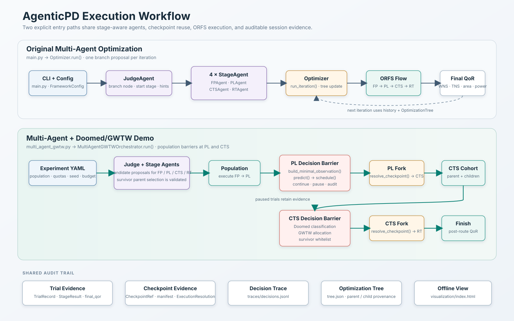
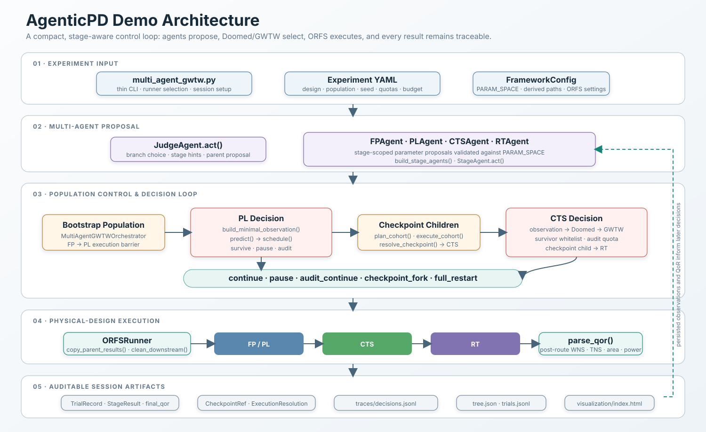

# AgenticPD

AgenticPD 是构建在 OpenROAD-flow-scripts（ORFS）之上的物理设计 QoR 优化实验框架。系统使用一个 `JudgeAgent` 和 FP、PL、CTS、RT 四个 `StageAgent` 生成受约束的参数建议，再由 ORFS 执行物理设计流程。最终评价以 post-route 报告中的 WNS、TNS、面积和功耗为准。

项目提供两条独立运行路径：

- `main.py`：原始多 Agent 迭代优化，使用优化树选择分支并逐阶段执行。
- `multi_agent_gwtw.py`：Doomed/GWTW Demo，在原有 Judge + 四个 Stage Agent 机制中加入 PL/CTS 两级 Doomed 分类、GWTW 资源分配和 checkpoint fork。

该 Demo 的目标是演示完整、可观察、可审计的闭环，不代表一定获得更优 QoR。

## Execution workflow



原始入口每轮生成一个分支候选；Doomed/GWTW Demo 先生成 population，在 PL 和 CTS 建立决策屏障。Doomed 识别应停止或审计的候选，GWTW 决定继续运行和补位数量，checkpoint resolver 决定 child 能否复用父 Trial 产物以及实际执行起点。

## Architecture



各层职责保持分离：Agent 只提出策略和参数；orchestrator 管理 population、预算与生命周期；manager 和 schema 保存证据；`ORFSRunner` 负责真实执行；QoR parser 读取最终报告。

## 环境准备

要求：

- Python 3.10 或更新版本
- 可正常运行的 ORFS 和目标 PDK
- 真实 Agent 模式所需的 OpenAI-compatible API key

从 `flow/agenticpd` 执行：

```bash
pip3 install -r requirements.txt
cp .env.example .env
```

在 `.env` 中设置 `DEEPSEEK_API_KEY`。不要将 `.env`、token 或密钥加入 Git。

正式运行前，先确认 ORFS 基线可用：

```bash
cd ..
make DESIGN_CONFIG=./designs/sky130hd/gcd/config.mk
cd agenticpd
```

## 原始多 Agent 优化

纯 Mock 调试不会调用 LLM 或 ORFS：

```bash
python3 main.py --mock-llm --mock-orfs --iterations 5
```

只运行真实 ORFS 基线，不调用 LLM：

```bash
python3 main.py --baseline-only --platform sky130hd --design gcd
```

运行真实多 Agent 优化：

```bash
python3 main.py --platform sky130hd --design gcd --iterations 3
```

恢复最近一次同设计 session：

```bash
python3 main.py --platform sky130hd --design gcd --resume latest
```

`main.py` 运行完成后会尝试生成传统优化树图片。原始结构化证据仍以 `tree.json`、Trial 文件和 ORFS 报告为准。

## Doomed + GWTW Demo

实验配置位于：

```text
configs/experiments/multi-agent-gwtw-demo.yml
```

先用相同控制流完成离线检查：

```bash
python3 multi_agent_gwtw.py \
  --config configs/experiments/multi-agent-gwtw-demo.yml \
  --mock-llm \
  --mock-orfs
```

运行真实 LLM + 真实 ORFS：

```bash
python3 multi_agent_gwtw.py \
  --config configs/experiments/multi-agent-gwtw-demo.yml
```

终端完成摘要会给出 `total_trials`、`budget_remaining`、`errors` 和
`finish_trials`。该摘要只能证明控制流结束；真实结果还应检查 finish
Trial 的 `final_qor` 和对应 ORFS post-route 报告。

## Session 证据与可视化

每次运行写入独立目录：

```text
runs/<platform>_<design>/<session>/
├── config_snapshot.json
├── trials.jsonl
├── tree.json
├── traces/decisions.jsonl
├── iter-<N>-<trial_id>/trial.json
└── visualization/
```

为任意已有 session 生成离线 HTML：

```bash
python3 tools/session_visualize.py \
  runs/sky130hd_gcd/<session>
```

结果保存在对应 session 内：

```text
runs/sky130hd_gcd/<session>/visualization/index.html
runs/sky130hd_gcd/<session>/visualization/session_data.json
```

直接用浏览器打开 `index.html`，不需要 HTTP server、网络或 CDN。页面展示配置、决策时间线、PL/CTS cohort、Trial、checkpoint fork、优化树和 finish QoR。HTML 是静态视图；需要审计时仍应回到 JSONL、Trial、checkpoint manifest 和 ORFS 原始报告。

## 查看、复现与清理

```bash
# 列出某个设计的 Trial
python3 tools/trial_inspect.py --list sky130hd gcd

# 查看一个 Trial 的阶段结果
python3 tools/trial_inspect.py <trial_id> --stages

# 查看清理范围，不执行删除
python3 tools/clean.py sky130hd gcd --dry-run
```

复现和清理可能启动真实 EDA 或删除运行产物，执行前应先阅读：

- `docs/usage/cli-verification.md`
- `docs/introduction/实验契约.md`

## 验证

仓库内可复现的纯 Python 检查：

```bash
make check
```

若本地保留了不进 Git 的 `tests/` 目录，还应运行：

```bash
make test
```

Mock 结果用于检查控制流，不能替代真实 LLM 决策或真实 ORFS QoR 证据。
