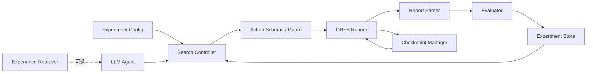

# Agentic-PD / ORFS-Agent 六周项目计划书

> 计划周期：约 45 天  
> 面向对象：具有数字电路基础、正在学习物理设计与 Agent 工程的大二学生  
> 当前责任范围：`3. Flow Optimization: Agentic-PD / ORFS-Agent`

## 1. 项目结论与范围

六周内可实现的目标不是“完整自主芯片设计平台”，而是一个可重复验证的 **OpenROAD flow 优化研究原型**：

> 给定设计、平台和优化目标，系统能够运行 ORFS，提取阶段与最终 QoR，受约束地选择下一组参数，从 checkpoint 继续执行，保存历史经验，并用固定 evaluator 比较默认配置、传统搜索和 LLM Agent。

### 1.1 必须完成

- 在固定环境中稳定跑通至少 3 个 ORFS 设计；
- 完成参数化执行、日志解析、实验记录和失败分类；
- 支持至少 placement、CTS、routing 三个阶段的参数白名单；
- 支持 checkpoint 或阶段结果复用；
- 实现 random/grid 与一种 BO baseline；
- 实现单 Agent 闭环：observe → reason → act → run → evaluate；
- 以 post-route WNS/TNS、area、power、DRC 和 runtime 评价；
- 至少完成 2 个开发设计和 1 个留出设计的对比实验；
- 能从空环境按文档复现一个小规模实验。

### 1.2 有余力再做

- 基于历史实验的 RAG/experience retrieval；
- Judge Agent + stage-specialized agents；
- MCP server；
- 简单 Web Dashboard；
- doomed-run early stopping；
- 多模型或多 prompt ablation。

### 1.3 六周内不做

- 同时支持 OpenROAD、Innovus、iEDA、ECOS Studio；
- 让 Agent 任意生成并执行 shell/Tcl；
- 直接修改 OpenROAD C++ 源码；
- 训练大模型；
- 追求 tapeout/signoff 级完整性；
- 为展示效果先做复杂前端。

## 2. MVP 架构



核心原则：LLM 不直接控制系统，只输出满足 schema 的 action。Runner、parser、evaluator 和 experiment store 都必须在没有 LLM 时独立工作。

## 3. 建议目录结构

正式创建代码项目前应先在项目源码根目录写独立 `AGENTS.md`，再采用类似结构：

```text
orfs-agent/
├── AGENTS.md
├── README.md
├── pyproject.toml
├── configs/
│   ├── designs/
│   ├── search_spaces/
│   └── experiments/
├── src/orfs_agent/
│   ├── runner/
│   ├── parser/
│   ├── checkpoint/
│   ├── evaluator/
│   ├── search/
│   ├── agent/
│   └── storage/
├── tests/
│   ├── unit/
│   ├── integration/
│   └── fixtures/
├── scripts/
├── docs/
└── runs/                 # 不进 git，只保存运行产物
```

所有设计路径、ORFS 路径、platform、超时和可调参数都放入 YAML/TOML 配置，不在 Python 中硬编码用户目录。

## 4. 数据模型先行

在写 Agent 之前，先固定四类结构化记录。

### 4.1 Experiment

- `experiment_id`
- `design`
- `platform`
- `orfs_commit`
- `openroad_commit`
- `config_hash`
- `objective`
- `budget`
- `seed`
- `created_at`

### 4.2 Trial

- `trial_id`
- `parent_trial_id`
- `resume_stage`
- `action`
- `status`
- `start_time`
- `end_time`
- `runtime_s`
- `artifact_dir`
- `failure_type`

### 4.3 Metrics

- `wns`
- `tns`
- `setup_violations`
- `hold_violations`
- `core_area`
- `total_power`
- `drc_count`
- `wirelength`
- `peak_memory`
- `runtime_s`

### 4.4 AgentTrace

- model 与参数；
- system prompt 版本；
- observation；
- retrieved experiences；
- proposed action；
- schema validation 结果；
- token 与费用；
- evaluator feedback。

不先固定这些字段，后期无法公平比较 baseline、Agent 和不同 prompt。

## 5. 评价函数

多目标优化不应一开始就随意加权。建议先使用分层评价：

1. **Feasibility gate**：运行成功、placement 合法、DRC 不恶化到阈值之外；
2. **Timing gate**：优先减少 WNS/TNS，特别是目标要求 timing closure 时；
3. **Secondary QoR**：在 timing 可比较时再比较 area、power；
4. **Cost**：记录 runtime、失败运行数、LLM token 与费用。

可使用归一化 score 进行排序，但原始指标必须完整保存：

```text
score =
    timing_term
  + lambda_area  * area_term
  + lambda_power * power_term
  + lambda_drc   * drc_penalty
  + lambda_time  * runtime_penalty
```

所有 `lambda`、归一化 baseline 和失败惩罚必须在实验开始前固定，不能看完结果再改。

## 6. 45 天执行计划

### 第 1 周：跑通并理解 ORFS

目标：不用 Agent，也能稳定、可重复地运行 flow。

学习内容：

- RTL→synthesis→floorplan→placement→CTS→routing→finish；
- netlist、LEF/DEF、Liberty、SDC、SPEF、GDS；
- setup/hold、slack、WNS、TNS；
- utilization、density、congestion、HPWL、DRC；
- Make、Tcl、ORFS `config.mk` 和目录结构；
- Docker/WSL、Git commit 固定和日志定位。

工程任务：

1. 固定 ORFS/OpenROAD commit 和运行环境；
2. 选择小、中、大三个设计，先以小设计为 smoke test；
3. 记录默认配置、命令、运行时间和最终指标；
4. 手工修改 2–3 个参数并观察结果；
5. 建立“常见失败—日志位置—处理方式”表。

本周交付：

- `environment.md`；
- 3 个设计的 baseline 表；
- 一条可复制的 smoke-test 命令；
- 每个 flow stage 的输入、输出和 checkpoint 表；
- 失败分类初版。

验收条件：

- 同一固定配置重复两次能得到可解释的一致结果；
- 能指出 WNS、TNS、area、power、DRC 分别来自哪个报告；
- 能从日志定位失败阶段。

### 第 2 周：构建非 Agent 实验基础设施

目标：把手工执行变成可测试的 Python 工具。

学习内容：

- Python subprocess、timeout、return code；
- dataclass/Pydantic、YAML/TOML；
- 正则与稳健 parser；
- pytest、fixture、mock；
- experiment tracking 与配置哈希。

工程任务：

1. 实现 `OrfsRunner`；
2. 实现 `ReportParser`；
3. 定义 `Experiment/Trial/Metrics`；
4. 将 stdout、stderr、环境、配置与 artifact 分目录保存；
5. 对缺失报告、超时、工具崩溃、QoR 不可行分别编码；
6. 给 parser 建立真实小日志 fixture。

本周交付：

- CLI：`run`、`parse`、`show-result`；
- 至少 10 个 parser 单元测试；
- 一个端到端 smoke test；
- CSV/JSONL/SQLite 三者中选一种 experiment store，建议 SQLite + JSON artifact。

验收条件：

- 断开 LLM 后，工具能独立运行并生成结构化结果；
- 重复运行相同配置能检测缓存或明确创建新 trial；
- 失败 trial 不会被误记为有效最优结果。

### 第 3 周：搜索空间、checkpoint 与传统 baseline

目标：先证明“优化问题和 evaluator 是有效的”，再接 LLM。

学习内容：

- grid/random search；
- Bayesian Optimization 的 surrogate、acquisition 和探索/利用；
- 多目标优化与 Pareto front；
- ORFS 阶段依赖与 checkpoint；
- early stopping 的误判风险。

工程任务：

1. 为 placement、CTS、routing 建立参数 schema；
2. 为每个参数记录类型、范围、默认值、影响阶段和约束；
3. 实现 action validation；
4. 实现 grid/random search；
5. 用 Optuna 或轻量 BO 实现一个 baseline；
6. 实现父 trial 与 resume stage；
7. 验证修改后续阶段参数不会错误复用前置结果。

本周交付：

- `search_space.yaml`；
- random/grid/BO 三种 controller；
- checkpoint DAG 或父子 trial 图；
- 单设计至少 20 个低成本 trial 的 Pareto 图；
- 参数敏感性初步分析。

验收条件：

- 非法参数在运行前被拒绝；
- 可追溯每个 trial 从哪个 checkpoint 分支；
- BO 至少能在 toy objective 或小设计上正常工作；
- 传统 baseline 的预算定义清楚。

### 第 4 周：实现单 Agent 闭环

目标：Agent 能基于结构化状态选择下一动作，而不是输出自由文本命令。

学习内容：

- tool calling / structured output；
- ReAct 的 observation-action-feedback 循环；
- prompt versioning；
- context budget、摘要和错误恢复；
- deterministic tool 与 nondeterministic policy 的边界。

工程任务：

1. 定义 Agent observation；
2. 定义严格 JSON action schema；
3. 实现 `propose_action`、校验、拒绝和重试；
4. 将 evaluator feedback 压缩为下一轮可用信息；
5. 增加最大轮数、最大失败数、wall-clock 和 token budget；
6. 使用 fake model 编写离线测试；
7. 在小设计上跑 5–10 轮真实 Agent。

建议 observation 只包含：

- 当前 stage；
- 当前配置与相对默认值；
- 当前与历史最佳 QoR；
- 关键 violation 摘要；
- 最近若干 action 及结果；
- 仍允许调整的参数；
- 剩余预算。

本周交付：

- 可插拔模型接口；
- 单 Agent 端到端 demo；
- 完整 trace；
- Agent 与 random/BO 在同预算下的初步比较；
- 失败案例列表。

验收条件：

- Agent 无法执行白名单之外的命令；
- 每个 action 都能解释对应 observation；
- 模型调用失败不会破坏实验状态；
- 同一 trace 可离线 replay。

### 第 5 周：经验检索与 stage-aware 优化

目标：让 Agent 利用过去结果，同时验证“经验积累是否真的有用”。

学习内容：

- RAG 的检索对象、索引与证据；
- case-based reasoning；
- stage-local objective 与 final QoR 的冲突；
- AgenticPD 的 Judge Agent、stage agent 与 checkpoint branching；
- 数据泄漏和留出设计。

工程任务：

1. 把成功和失败 trial 转成 experience record；
2. 先实现 metadata/filter 检索，再考虑 embedding；
3. 检索条件至少含 design features、stage、parameter 与 failure type；
4. 实现 `no-memory` 与 `with-memory` 两种模式；
5. 可选实现一个 Judge Controller，决定继续本阶段、回退或进入下一阶段；
6. 在第二个开发设计上迁移经验。

不要把全部日志塞入向量库。经验记录应是：

- 条件；
- action；
- 指标变化；
- 是否通过 final evaluation；
- 适用范围；
- 失败原因；
- 原始 trial 引用。

本周交付：

- experience schema；
- 检索模块；
- no-memory/with-memory ablation；
- stage-local improvement 与 final QoR 冲突案例；
- 留出设计不进入检索库的检查。

验收条件：

- 检索结果能追溯到原始 trial；
- 不使用测试设计结果指导同一测试设计的早期 trial；
- 能回答 memory 提升的是成功率、QoR 还是运行效率。

### 第 6 周：系统实验、消融、文档与演示

目标：形成可以向导师展示和写进报告的证据，而不是只展示一次成功运行。

实验矩阵建议：

| 组别 | Controller | Memory | 作用 |
|---|---|---|---|
| A | Default | 无 | ORFS baseline |
| B | Random/Grid | 无 | 简单搜索 baseline |
| C | BO | 无 | 非 LLM 强 baseline |
| D | LLM Agent | 无 | Agent 本体 |
| E | LLM Agent | 有 | 经验积累效果 |

每组固定：

- 相同设计和工具 commit；
- 相同最大 trial 数或 wall-clock；
- 相同 evaluator；
- 至少 3 个 seed 或 3 次独立运行；
- 原始指标、最佳指标、成功率、runtime 与成本。

工程任务：

1. 冻结代码、配置和 prompt；
2. 运行开发设计与留出设计；
3. 绘制 best-so-far、Pareto、成功率和成本图；
4. 分析至少 3 个失败案例；
5. 从空环境复现 smoke test；
6. 完成 README、架构图、演示脚本和已知限制；
7. 准备 8–12 分钟演示。

最终交付：

- 可运行源码；
- 环境锁定文件；
- benchmark 配置；
- 完整实验记录；
- 对比表和图；
- 项目报告；
- demo；
- 下一阶段路线图。

## 7. 每日工作节奏

建议每周 6 天，每天分为三块：

1. 1.5–2 小时学习：只学当天工程任务直接需要的概念；
2. 4–5 小时实现与运行；
3. 1 小时整理：记录命令、失败、结果和第二天假设。

每天结束必须留下：

- 今天验证了什么；
- 哪个结论有数据支持；
- 哪个失败仍未解释；
- 明天第一个可执行动作；
- 是否需要更新长期笔记。

不要连续几天只读论文。采用“读一小段—实现一个机制—用实验验证”的循环。

## 8. 论文阅读顺序

### 第一优先级：直接服务当前实现

1. `AgenticPD.pdf`：stage-aware agent、Judge Agent、checkpoint branching；
2. `InsightAlign.pdf`：physical design recipe 推荐与迁移；
3. `Doomed-Run-Prediction.pdf`：早期阶段预测最终 timing；
4. `PDAGENT-BENCH.pdf`：能力维度和 agent workflow 评价；
5. `Protected-White-Box-DSE.pdf`：protected evaluator、搜索边界与可复用 evidence。

### 第二优先级：方法与评价补充

6. `TicTacBench.pdf`：timing closure 任务和 agent failure taxonomy；
7. `CHIP-MAP.pdf`：multi-agent feedback-driven placement；
8. `VeoPlace.pdf`：foundation model 与 evolutionary search 结合；
9. `Expert-Level-RL-Placement.pdf`：expert reward 与 placement；
10. `RTLScout.pdf`：elite pool、闭环 RTL 优化和 Pareto。

### 暂缓

- `ArtNet.pdf`：等需要训练数据或 surrogate model 时再读；
- `ModuPlace.pdf`：PCB placement，不是当前主线；
- `Go-With-The-Winners.pdf`：通用搜索理论，遇到并行随机搜索问题时再回看。

阅读时不要追求逐篇全文翻译。每篇先回答：

1. 它的 action space 是什么？
2. observation/feedback 是什么？
3. evaluator 是否与候选隔离？
4. 如何处理失败、超时和正确性？
5. 实验预算如何公平？
6. 哪个机制可以直接进入当前代码？

## 9. 必学知识清单

### 9.1 数字 IC 后端

- synthesis 与 technology mapping；
- floorplan、macro placement、standard-cell placement；
- legalization 与 detailed placement；
- CTS、skew、latency；
- global routing、detailed routing；
- setup/hold timing、WNS/TNS；
- parasitic extraction、STA；
- congestion、DRV、DRC；
- PPA、QoR、TAT；
- LEF/DEF、Liberty、SDC、SPEF、GDS。

### 9.2 OpenROAD/ORFS

- Make 与 `config.mk`；
- Tcl 基础；
- ORFS stage targets；
- OpenROAD Tcl/Python API；
- OpenDB 基础；
- logs/reports/results；
- Docker/WSL 环境；
- checkpoint、缓存与并行实验。

### 9.3 优化

- grid/random search；
- Bayesian Optimization；
- Pareto optimality；
- 约束优化；
- normalization 与多目标 score；
- early stopping；
- sample efficiency；
- seed、方差与显著性。

### 9.4 Agent 工程

- structured output/tool calling；
- ReAct；
- prompt 与 schema versioning；
- context management；
- RAG 与 experience retrieval；
- trace、replay、预算和可观测性；
- sandbox、白名单和 evaluator isolation。

### 9.5 软件工程

- Python packaging；
- Pydantic/dataclass；
- pytest；
- SQLite/JSONL；
- subprocess、timeout、signal；
- Git、Docker；
- 配置哈希和 artifact 管理；
- 日志分级与失败码。

## 10. 关键工程注意事项

### 10.1 可重复性

- 记录所有 repo commit SHA；
- 固定容器、PDK、标准单元库和设计输入；
- 保存完整命令和环境摘要；
- 每个 trial 使用唯一目录；
- 不覆盖历史结果；
- 记录 seed。

### 10.2 安全性

- Agent 只输出 schema，不输出可直接执行的任意 shell；
- 参数名、类型、范围和枚举值全部白名单；
- evaluator 与候选工作区分离；
- API key 只从环境读取且不写日志；
- 设定 CPU、内存、磁盘、wall-clock 和 token 限制。

### 10.3 指标真实性

- 中间 stage 指标只用于决策，不作为最终胜负；
- 最终候选必须跑 post-route；
- timing、area、power 必须来自同一工具版本和 corner；
- DRC/合法性失败不能通过加权 score 被“抵消”；
- 同时报告绝对值和相对 baseline 的变化。

### 10.4 实验公平性

- baseline 与 Agent 使用相同预算；
- 不能只展示最好的一次；
- prompt 调试使用开发设计，留出设计只做最终评价；
- 失败运行计入预算；
- 比较 QoR 时同时报告 runtime 与 LLM 成本。

## 11. 里程碑与止损点

| 时间 | 必须达到 | 未达到时的止损 |
|---|---|---|
| 第 7 天 | 3 个 ORFS baseline | 缩为 1 个设计，先解决环境 |
| 第 14 天 | Runner + Parser + Store | 暂停所有 Agent/RAG 工作 |
| 第 21 天 | 至少两种非 LLM 搜索 | 缩小参数空间和设计规模 |
| 第 28 天 | 单 Agent 闭环 | 不做多 Agent/MCP |
| 第 35 天 | memory ablation 初步结果 | memory 降级为规则检索 |
| 第 42 天 | 完整实验矩阵 | 停止新增功能，转向复现与报告 |

如果到第 21 天仍不能稳定解析 QoR，项目问题不在 LLM，而在基础执行层。此时继续增加 Agent 复杂度只会放大错误。

## 12. 向导师汇报时应回答的问题

1. Agent 的 action space 为什么这样限定？
2. 为什么最终评价采用 post-route 而不是 placement 指标？
3. checkpoint 复用节省了多少时间？
4. 与 random/BO 相比，LLM Agent 在相同预算下提升了什么？
5. memory 是否跨设计有效，还是只记住了单个设计？
6. 哪些失败是模型问题，哪些是工具/环境问题？
7. 结果对模型、prompt 和 seed 是否稳定？
8. 当前原型离 Tool-Evolve 还缺哪些安全边界？

## 13. 六周后的下一步

完成 Flow Optimization MVP 后，再按以下顺序扩展：

1. doomed-run predictor 与更可靠的 early stopping；
2. Judge Agent + stage-specialized agents；
3. MCP 化稳定工具接口；
4. 更严格的 PDAGENT/TicTac 风格 benchmark；
5. protected evaluator 下的 OpenROAD source-level Tool-Evolve；
6. 最后再做统一 UI 和 dashboard。

顺序不能反过来。平台的学术价值来自可验证的闭环、经验积累和公平实验，不来自界面组件数量。
